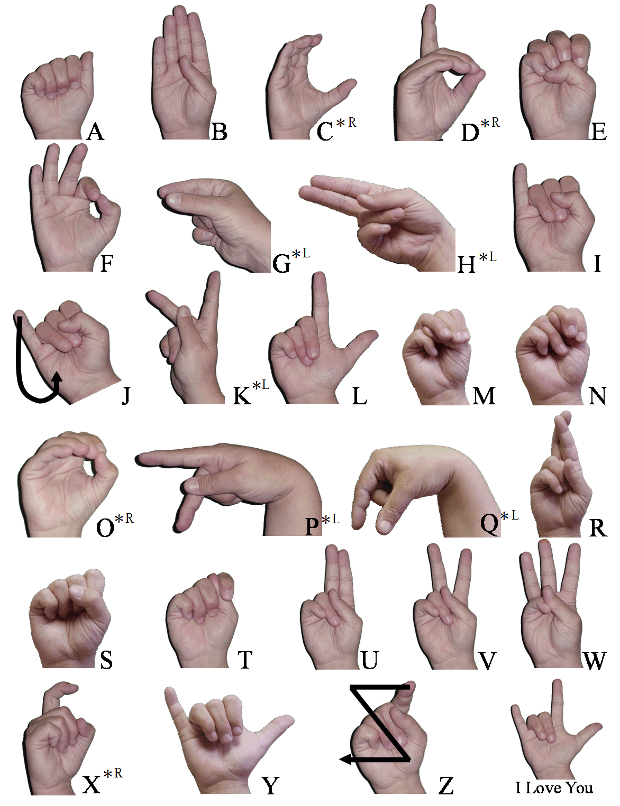

# 

# American Sign Language Detection (ASL) GUI

## Project Introduction

The American Sign Language Detection GUI is an interactive application for real-time hand gesture recognition. It utilizes the Mediapipe library for hand tracking and a pre-trained model to predict American Sign Language (ASL) letters from the detected hand gestures.

## Features
- Real-time hand gesture detection and ASL letter prediction
- User-friendly graphical interface
- ASL reference guide for quick learning
- Customizable and extendable for educational or practical purposes

## [Demo Video](https://drive.google.com/file/d/1MZvZceLw-vzuSm8t-1DvHP-eNPaClOMU/view?usp=sharing)

## ASL Reference Guide



## Contributors

- **[Waddah Alhajar](https://www.linkedin.com/in/YOUR_LINKEDIN_PROFILE_URL_HERE)**  
- **[Daniel Fu](https://www.linkedin.com/in/YOUR_LINKEDIN_PROFILE_URL_HERE)**
- **[Srinjan Ghosh](https://www.linkedin.com/in/YOUR_LINKEDIN_PROFILE_URL_HERE)**
- **[Mursal Furqan Kumbhar](https://www.linkedin.com/in/YOUR_LINKEDIN_PROFILE_URL_HERE)**

## Getting Started

To run the ASL Detection GUI on your local machine, follow these steps:

1. Clone the repository:

```bash
git clone https://github.com/YOUR_USERNAME/your-repository.git
```

2. Install the required dependencies:

```bash
pip install -r requirements.txt
```

3. Run the application:

```bash
python asl_gui.py
```

## Acknowledgments

- [Mediapipe Library](https://google.github.io/mediapipe/)

## License

This project is licensed under the [MIT License](LICENSE).
